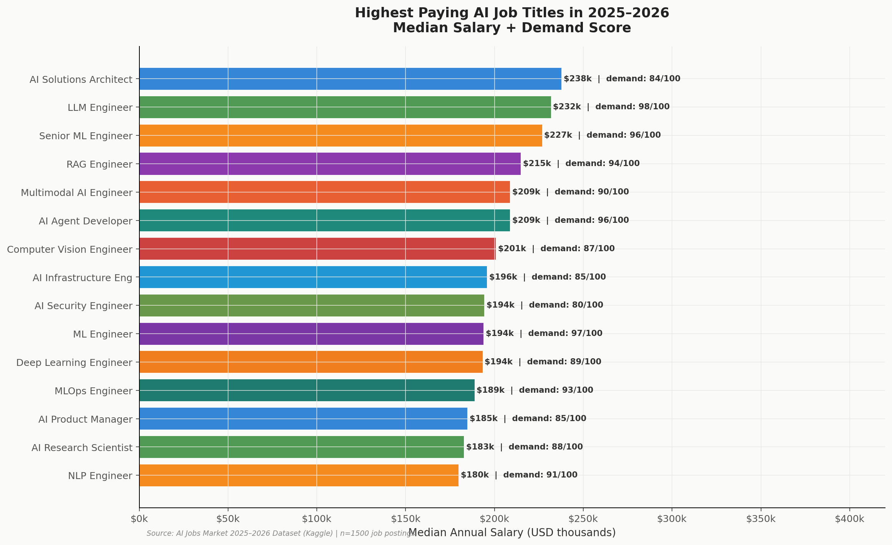
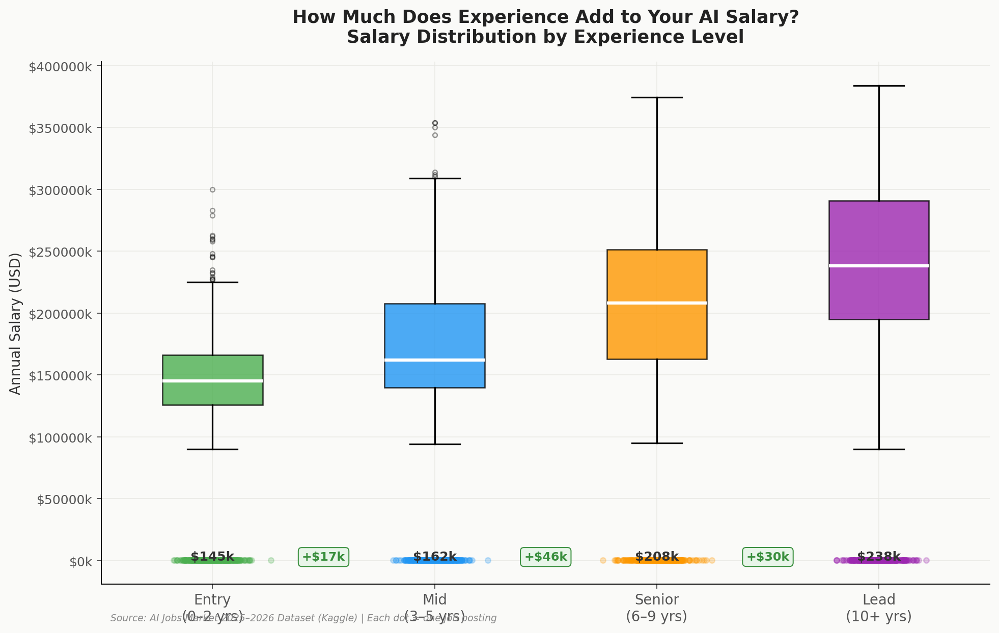
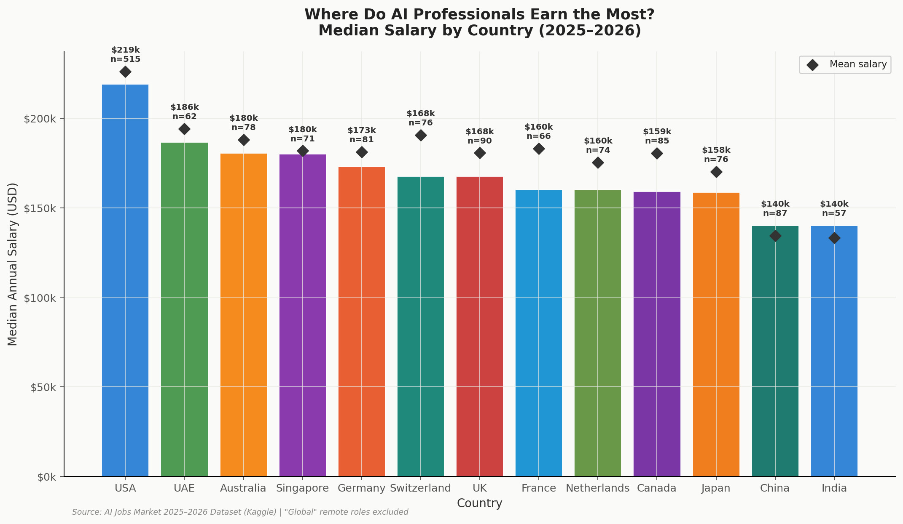
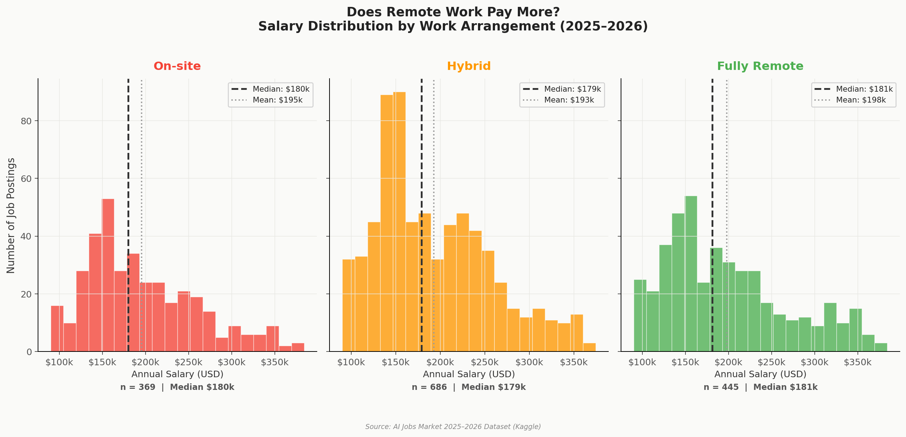
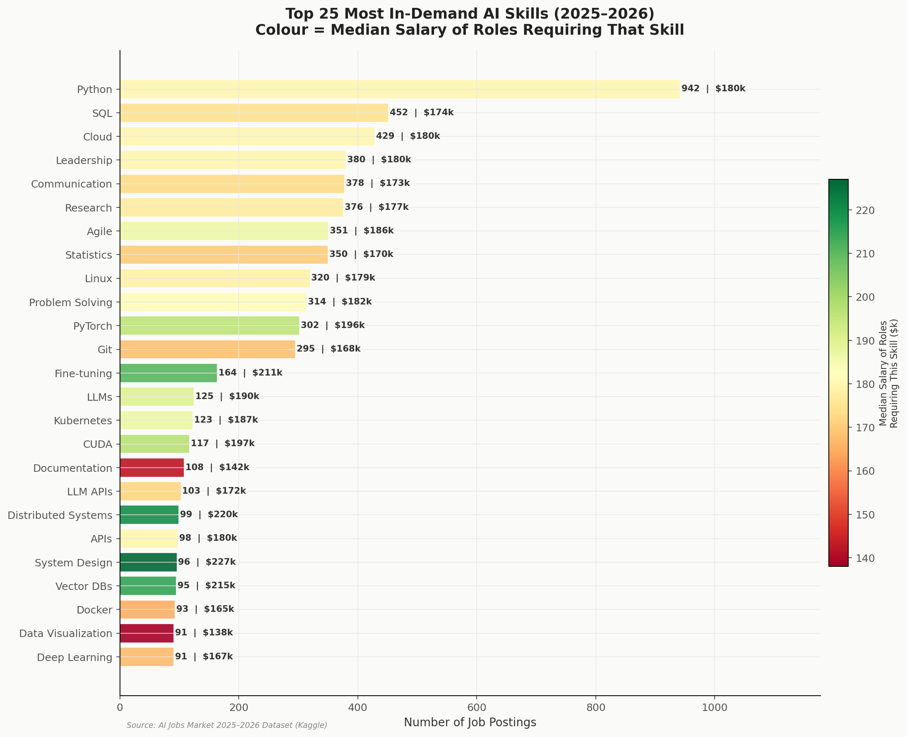
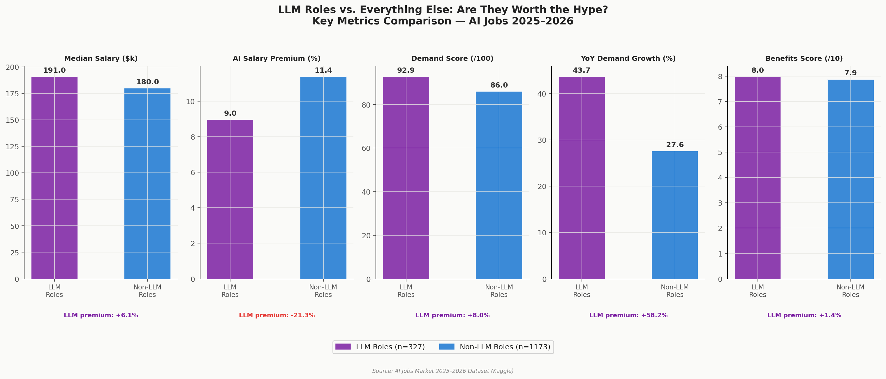

# 🤖 AI Jobs Market Analysis (2025–2026) 💸


This project provides a comprehensive Exploratory Data Analysis (EDA) of the global AI and Large Language Model (LLM) job market during 2025–2026. The study examines compensation trends, experience scaling, geographic distributions, remote work arrangement pricing, skill values, and the specialized premium offered to LLM engineering positions.

> [!NOTE]
> **Read the full writeup on Medium:** [The Uncomfortable Truth About AI Salaries: From 1,500+ Real Job Postings](https://medium.com/@alicankaya268/the-uncomfortable-truth-about-ai-salaries-from-1-500-real-job-postings-19ac76bd6f53)

---

## 📌 Table of Contents
1. [Project Overview](#project-overview)
2. [Dataset Description](#dataset-description)
3. [Folder Structure](#folder-structure)
4. [Installation & Setup](#installation--setup)
5. [How to Run](#how-to-run)
6. [Visualizations & Key Findings](#visualizations--key-findings)
7. [License](#license)
8. [Contact & Links](#contact--links)

---

## 🌐 Project Overview
With the transition from generative AI experiments to large-scale enterprise integration, artificial intelligence positions have become highly specialized. This repository contains:
- `ai_jobs_analysis.py`: A fully commented Python script that reads the dataset, structures the data, and renders six high-resolution charts.
- `AI_Jobs_Market_Analysis_2025_2026.ipynb`: A Kaggle-ready Jupyter Notebook detailing the data loading, analysis logic, code comments, and outputs step-by-step.

---

## 📊 Dataset Description
The analysis uses the **AI Jobs Market 2025–2026** dataset, containing details on annual salary bounds, required experience, education levels, remote status, location (cities/countries), company sizes, and specific skill listings. 

Key attributes examined include:
- `annual_salary_usd`: Annual compensation in USD.
- `experience_level`: Entry (0-2 yrs), Mid (3-5 yrs), Senior (6-9 yrs), and Lead (10+ yrs).
- `remote_work`: Work modes (`Fully Remote`, `Hybrid`, `On-site`).
- `required_skills`: Individual programming, AI, and domain tags.
- `is_llm_role`: Flag showing if the role specifically requires Large Language Model/GenAI specialization.

---

## 📁 Folder Structure
```text
AI Jobs Market 2025-2026 Salaries/
│
├── dataset/
│   └── ai_jobs_market_2025_2026.csv   # Source CSV dataset
│
├── results/                            # Output folder for visualization charts
│   ├── ai_market_banner.png           # Simple job-focused banner graphic
│   ├── ai_top_paying_job_titles.png   # Chart 1: Top job titles
│   ├── ai_salary_by_experience.png    # Chart 2: Experience progression
│   ├── ai_salary_by_country.png       # Chart 3: Location salaries
│   ├── ai_salary_remote_vs_onsite.png # Chart 4: Remote vs On-site vs Hybrid
│   ├── ai_top_skills_demand_salary.png# Chart 5: Skill heatmap & popularity
│   └── ai_llm_vs_nonllm_comparison.png# Chart 6: LLM roles premium analysis
│
├── ai_jobs_analysis.py                 # Documented Python script
├── AI_Jobs_Market_Analysis_2025_2026.ipynb # Kaggle-formatted Jupyter Notebook
├── .gitignore                          # Standard git exclusions
├── LICENSE                             # MIT license terms
└── README.md                           # Main documentation (this file)
```

---

## 🛠️ Installation & Setup

1. **Clone the Repository**:
   ```bash
   git clone https://github.com/yourusername/ai-jobs-market-analysis.git
   cd ai-jobs-market-analysis
   ```

2. **Set up Python Environment** (recommended):
   ```bash
   python -m venv .venv
   source .venv/bin/activate  # On Windows: .venv\Scripts\activate
   ```

3. **Install Dependencies**:
   Ensure you have `pandas`, `numpy`, `matplotlib`, and `scipy` installed:
   ```bash
   pip install pandas numpy matplotlib scipy notebook
   ```

---

## 🚀 How to Run

### Run the Python Script
This script parses the dataset, calculates statistical aggregates, and updates the figures inside the `results/` folder:
```bash
python ai_jobs_analysis.py
```

### Run the Jupyter Notebook
Open the interactive workspace to run the data analysis steps individually:
```bash
jupyter notebook AI_Jobs_Market_Analysis_2025_2026.ipynb
```

---

## 📈 Visualizations & Key Findings

Below are the six generated plots detailing findings from the dataset:

### 1. Highest Paying AI Job Titles
Identifies the top 15 most lucrative positions in the market along with their associated industry demand scores.


### 2. Salary Distribution by Experience Level
Measures the step-up financial values (`+$Xk`) added as an AI professional advances from entry-level to lead.


### 3. Geographic Salary Differences
Highlights country-specific salary ranges and overlays median values with mean diamonds to identify outlier markets.


### 4. Work Arrangement Comparison
Examines how on-site, hybrid, and fully remote models compare in salary rates and volume.


### 5. In-Demand Skills & Salary Value
A dual-axis visualization mapping skill frequencies (bar length) to median compensation levels (bar color).


### 6. The LLM Premium (LLM Roles vs. Traditional AI)
Shows comparison metrics (Salary, Growth, Perks, Demand) between specialized LLM roles and generic AI positions.


---

## 📄 License
This project is licensed under the terms of the [MIT License](LICENSE).

---

## 🔗 Contact & Links

If you want to connect, collaborate, or check out more of my work, feel free to visit my profiles:

- **Medium Article:** [The Uncomfortable Truth About AI Salaries: From 1,500+ Real Job Postings](https://medium.com/@alicankaya268/the-uncomfortable-truth-about-ai-salaries-from-1-500-real-job-postings-19ac76bd6f53)
- **Personal Website:** [alican-kaya.com](https://alican-kaya.com/)
- **Kaggle:** [alicankayaoni](https://www.kaggle.com/alicankayaoni)
- **LinkedIn:** [Alican Kaya](https://www.linkedin.com/in/alican-kaya-881650234/)

